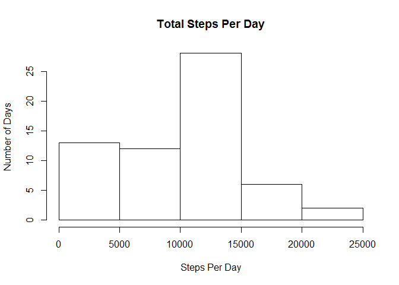
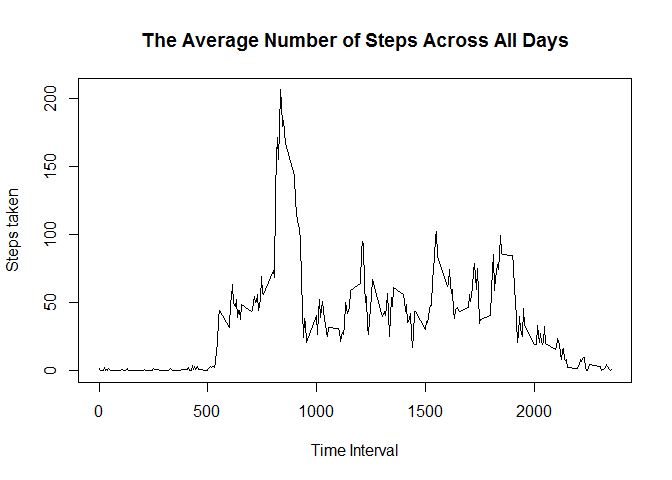
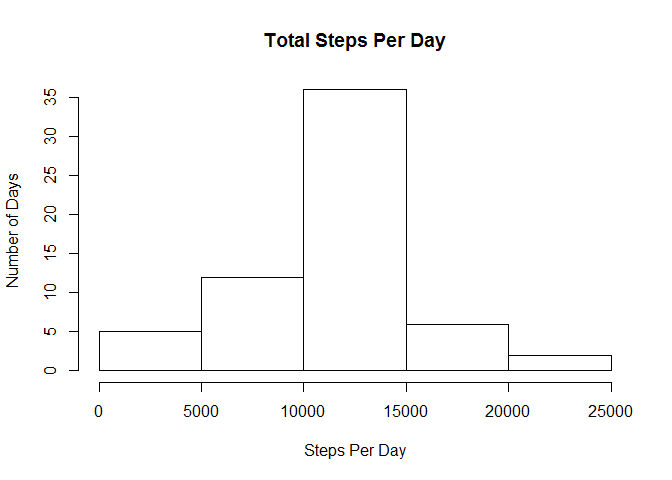
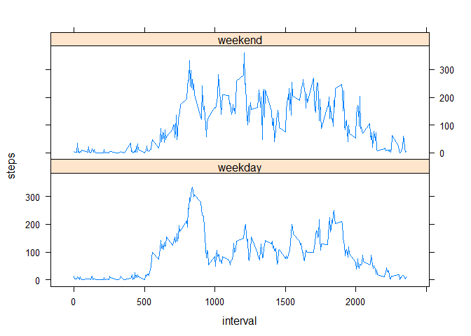

# Reproducible Research: Peer Assessment 1


**Loading and processing the data**

After Unzipping the **repdata_data_activity.zip** file in our R working directory, we can read the **activity** data set using ```read.csv() ```


```r
A=read.csv("activity.csv")
```


**What is mean total number of steps taken per day?**

For this part of the assignment, we ignore the missing values in the dataset and do the following:

1- Calculate the total number of steps taken per day


```r
a=A[!is.na(A$steps),]
S=split(a,f=a$date)
steps=lapply(S,function(x) x[,1])
sum=as.data.frame(sapply(steps,sum))
sum$date=as.Date(rownames(sum))
rownames(sum)=NULL
colnames(sum)=c("total_steps_per_day","date")
```

2- Make a histogram of the total number of steps taken each day


```r
hist(sum[,1],main="Total Steps Per Day",xlab="Steps Per Day",ylab="Number of Days")
```

 

3- Calculate and report the mean and median of the total number of steps taken per day


```r
Summary=summary(sum$total_steps_per_day)
summary=t(as.matrix(Summary))
summary[,c(3,4)]
```

```
## Median   Mean 
##  10400   9354
```


**What is the average daily activity pattern?**

To answer this question we can Make a time series plot (i.e. ```type = "l"```) of the 5-minute interval (x-axis) and the average number of steps taken, averaged across all days (y-axis). To do this, we shall run the following code:


```r
st=sapply(S,function(x) x[,1])
ST=(do.call(cbind,st))
rowMeans=as.data.frame(rowMeans(ST))
rowMeans$interval=S[[2]]$interval
colnames(rowMeans)[1]="Average_Steps"
plot(rowMeans$interval,rowMeans$Average_Steps,type="l",main="The Average Number of Steps Across All Days",xlab="Time Interval",ylab="Steps taken")
```

 

Which 5-minute interval, on average across all the days in the dataset, contains the maximum number of steps?


```r
rowMeans[which(rowMeans$Average_Steps==max(rowMeans$Average_Steps)),]
```

```
##     Average_Steps interval
## 104      206.1698      835
```

As the results show, on average, across all the days in the dataset, the maximum number of steps occurs during interval 835


**Imputing missing values**

In our examined data set **activity** there exist a number of days/intervals where there are missing values (coded as NA). Since the presence of missing days may introduce bias into some calculations or summaries of the data, it is a good idea to replace them with some appropriate value. To do this, we do the following: 

1- Calculate and report the total number of missing values in the dataset (i.e. the total number of rows with NAs)


```r
sum(is.na(A$steps))
```

```
## [1] 2304
```

2- Devise a strategy for filling in all of the missing values in the dataset:

By running the following code, NA values in each interval, will be replaced with average steps taken in that interval, averaged across all days. 


```r
I=split(A,f=A$interval)
m=as.matrix(sapply(I,function(x) mean(x[,1],na.rm=T)))            
for(i in 1:288){
        I[[i]][is.na(I[[i]])]=m[i]
}
```

3- Create a new dataset that is equal to the original dataset but with the missing data filled in.

Running the following code, results in a data set named **ds**  in which the missing values are filled in using the strategy introduced above.


```r
df=do.call(rbind.data.frame,I)
ds=do.call(rbind.data.frame,split(df,f=df$date))
rownames(ds)=NULL
```

*Now we make a histogram of the total number of steps taken each day and Calculate and report the mean and median total number of steps taken per day to see if these values differ from the estimates from the first part of the assignment? What is the impact of imputing missing data on the estimates of the total daily number of steps?*


```r
## Make a histogram of the total number of steps taken each day

S=split(ds,f=ds$date)
steps=lapply(S,function(x) x[,1])
sum=as.data.frame(sapply(steps,sum))
sum$date=as.Date(rownames(sum))
rownames(sum)=NULL
colnames(sum)=c("total_steps_per_day","date")
hist(sum[,1],main="Total Steps Per Day",xlab="Steps Per Day",ylab="Number of Days")
```

 

```r
## calculating the mean & median for new data set

Summary=summary(sum$total_steps_per_day)
summary=t(as.matrix(Summary))
summary[,c(3,4)]
```

```
## Median   Mean 
##  10770  10770
```

As we can see, as the result of the replacing NA values with average steps taken in corresponding intervals, the histogram is now more centralized and symmetric and the mean & median of the new data set have the same values. 


**Are there differences in activity patterns between weekdays and weekends?**

For this part, we use ```weekdays()``` function and the dataset with the filled-in missing values.

To answer this question we do the following:

1- Create a new factor variable in the dataset with two levels - **weekday** and **weekend** indicating whether a given date is a weekday or weekend day.


```r
##Create a new factor variable in the dataset with two levels - "weekday" and "weekend"

ds$weekdays=weekdays(as.Date(ds$date))
DS=as.matrix(ds)
DS[,4][!DS[,4]=="Sunday"]="weekday"
DS[,4][DS[,4]=="Sunday"]="weekend"
ds=as.data.frame(DS)
```

2- Make a panel plot containing a time series plot (i.e. ```type = "l"```) of the 5-minute interval (x-axis) and the average number of steps taken, averaged across all weekday days or weekend days (y-axis).


```r
spds=split(ds,f=ds$weekdays)
ds_weekday=spds[[1]]
ds_weekend=spds[[2]]
weekday=aggregate(as.numeric(ds_weekday$steps),list(i=ds_weekday$interval),mean)
weekday$i=S[[2]]$interval
weekend=aggregate(as.numeric(ds_weekend$steps),list(i=ds_weekend$interval),mean)
weekend$i=S[[2]]$interval
rep=rep(c("weekday","weekend"),each=288)
w=rbind(weekday,weekend)
colnames(w)=c("interval","steps")
w$weekdays=rep
W=transform(w,weekdays=factor(weekdays))
W=transform(w,weekdays=factor(weekdays))

library(lattice)
xyplot(steps~interval|weekdays,data=W,layout=c(1,2),type="l")
```

 

By looking at the figure above, we can conclude that on average, there were slightly more steps taken on weekends in comparison with weekdays, especially during the mid hours of the day.
